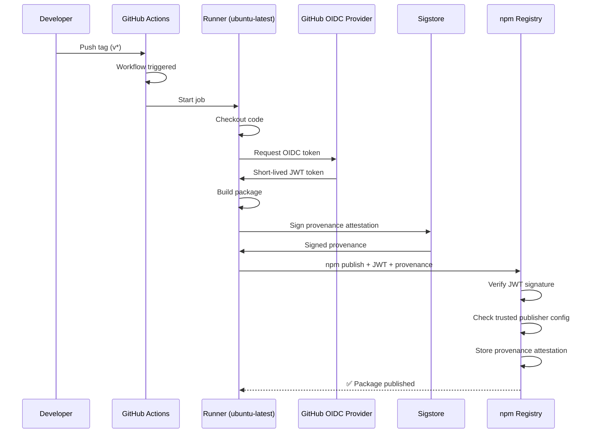

# cloud-native-days-france-2026-hello

A simple hello CLI for Cloud Native Days France 2026 - Trusted Publishing with npmjs.com lab.

## What is Trusted Publishing?

Trusted Publishing allows you to publish npm packages directly from CI/CD workflows (like GitHub Actions) **without storing any npm tokens**. It uses OpenID Connect (OIDC) to establish a trust relationship between npm and your CI/CD provider.

### Why use it?

| Traditional Token-based | Trusted Publishing |
|------------------------|-------------------|
| Long-lived tokens that can be leaked | Short-lived, auto-generated credentials |
| Manual token rotation needed | No secrets to manage |
| Tokens can be stolen and reused | Credentials scoped to specific workflow |
| Risk of accidental exposure in logs | Cryptographically signed, non-extractable |

### How it works



### Key benefits

- **No secrets** - No npm tokens stored in GitHub secrets
- **Automatic provenance** - The runner generates cryptographic proof (signed by Sigstore) of where and how your package was built
- **Scoped access** - Only the specific workflow you configure can publish
- **Industry standard** - Same approach used by PyPI, RubyGems, and other registries

> 📚 Learn more: [npm Trusted Publishing documentation](https://docs.npmjs.com/trusted-publishers)

## Installation

```bash
npm install -g cloud-native-days-france-2026-hello
```

## Usage

```bash
# Print hello message
cloud-native-hello
# Output: Hello Cloud Native Days France 2026!

# Output as JSON
cloud-native-hello --json
# Output: {"message":"Hello Cloud Native Days France 2026!"}

# Show help
cloud-native-hello --help

# Show version
cloud-native-hello --version
```

## Development

```bash
# Run locally
npm start

# Build (syntax check)
npm run build
```

## License

MIT
